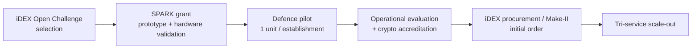

# iDEX Open Challenge — Commercialization Plan

*Capability statements are tagged to repository evidence (**[measured] [tested]
[implemented] [design]**). Commercial, schedule, and funding figures are
**plans/projections**, explicitly not measured product claims.*

## Positioning

SYNTRIASS Overlay is a **sovereign PQC migration platform** — software that
upgrades the existing Linux application estate to quantum-safe, fail-closed,
kernel-enforced transport without rewriting applications. It is a **software**
product (no bespoke silicon required), which makes the adoption, procurement, and
support paths fast and low-capex relative to hardware crypto appliances.

## Defence Adoption Path

1. **Land** with the highest-pain, highest-value use case: HNDL protection for
   long-secrecy traffic on an air-gapped or strategic enclave (Strategic Command
   profile), where the fail-closed-by-construction guarantee is most compelling.
2. **Expand** to tactical tiers (Tactical/Legacy profiles) once the kTLS data
   plane and native-hardware numbers are measured (TRL-6 items).
3. **Standardise** as the sovereign PQC-migration overlay across a network tier.

## Pilot Path

- **Scope (Phase A, ~0–6 months):** wrap a small set of **non-critical** existing
  applications on a representative network slice (3–10 nodes) at a consenting
  establishment; Strategic + Tactical + Legacy profiles; fleet management from a
  control node.
- **Success metrics (measured during pilot):** zero plaintext on the wire;
  session-establishment latency and availability under induced degradation;
  policy/quarantine convergence; upgrade/rollback without outage; operator
  workload for 10→50 nodes.
- **Phase B (~6–12 months):** widen to a larger slice; activate the kTLS data
  plane on accredited hardware; begin crypto accreditation evidence collection.
- The pilot is exactly the vehicle that converts the six named `[design]` items
  (`docs/IDEX_TRL_PACKAGE.md`) into measured results.

## SPARK Grant Utilization (indicative — plan, not a claim)

| Allocation | Purpose | Deliverable / exit |
|---|---|---|
| ~30 % | **Independent cryptographic review** + remediation | published review; findings closed |
| ~25 % | **Hardware validation** — native ARM64 (Graviton/Ampere), physical TPM/HSM, kTLS-ULP host | every `[design]` perf tag → `[measured]`; kTLS throughput ≥28 % line / ~2× target tested |
| ~25 % | **Multi-host pilot** — 10→50 real nodes, signed online policy distribution, k8s per-pod attach | TRL-6 field-representative demonstration |
| ~20 % | **Production hardening** — daemon-loop integration, packaging, operator tooling, accreditation documentation | pilot-ready, evaluation-entry release |

(The iDEX SPARK instrument supports prototype development and validation; the
above maps the grant directly onto the engineering gaps the repository already
identifies — no scope is invented.)

## Procurement Path

- **iDEX procurement order / Make-II** following a successful pilot and
  evaluation, as the standard iDEX commercialization route for a selected
  challenge winner.
- **Software-licence model** (per-node or per-site, perpetual + support, or
  subscription) suited to estate-wide rollout; no per-unit hardware BOM.
- **Crypto accreditation** by the relevant national authority is a procurement
  prerequisite and is scheduled into Phase B of the pilot.

## Manufacturing / Deployment Path

- **No manufacturing** in the hardware sense — the product is software delivered
  as a **signed offline package** (`deploy/package.sh` produces an offline tarball
  + SHA256SUMS; install/upgrade/rollback tooling exists) [tested].
- **Deployment** is `install → configure → validate → run` on a fresh or
  air-gapped host with no source build [tested]; fleet rollout via the offline
  inventory/distribution tooling (tested to 120 nodes) [tested].
- **Packaging hardening** (package *signing* against an active adversary) is
  `[design]` and scoped in the grant.

## Support Model

- **Tiered support:** L1 operator support + documentation; L2 deployment/fleet
  engineering; L3 cryptographic/kernel engineering for incident response and
  accreditation.
- **Sovereign maintenance:** Indian-controlled source, build, and key custody;
  reproducible builds; signed offline update packages for air-gapped sites.
- **Lifecycle:** crypto-agility is built in (suite negotiation, multiple ML-KEM
  parameter sets) so future PQC-standard updates are a configuration/upgrade, not
  a re-engineering — protecting the customer's investment as the threat evolves.

## Competitive moat (evidence-grounded)

- **Kernel fail-closed** (343 ns) — userspace competitors cannot guarantee
  no-leak under host compromise [measured].
- **OOB identity** (−81 % handshake) — uniquely suited to constrained defence
  bearers [measured].
- **Migration overlay** — no application rewrite, unlike per-app PQC-TLS swaps.
- **Sovereign + memory-safe + air-gap-native** — matches defence procurement and
  operating constraints that foreign or enterprise-cloud products do not.
