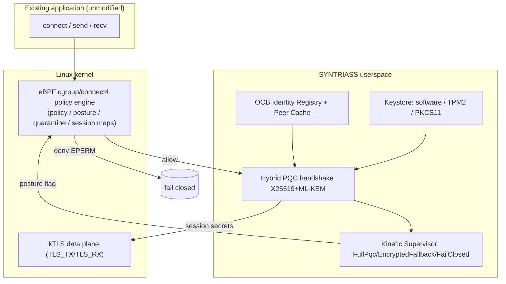
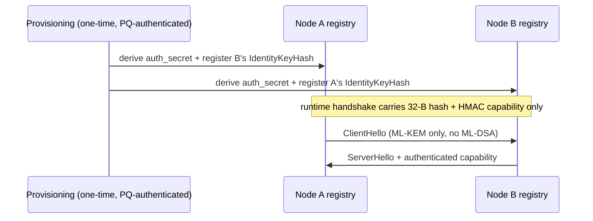
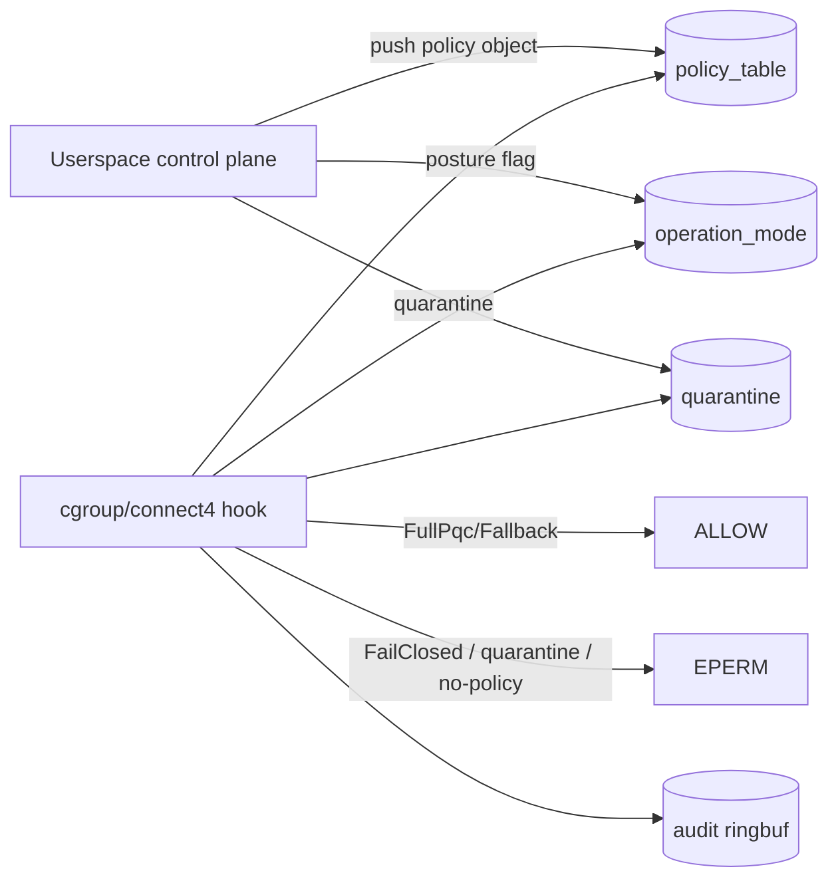
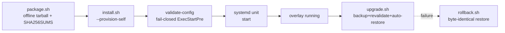
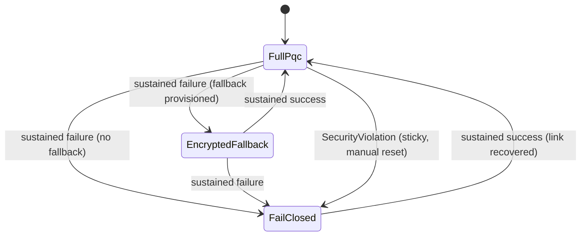

# iDEX Open Challenge — Proposed Technical Solution

*Evidence tags throughout: **[measured]** real run · **[tested]** automated
assertion · **[implemented]** code exists · **[design]** planned. All numbers
trace to in-repo scripts, `cargo test`, and `cargo bench`; the ledger is
`docs/DEFENCE_READINESS_REVIEW.md`.*

## Executive Summary

SYNTRIASS Overlay is a **post-quantum, fail-closed communications overlay** that
upgrades existing Linux applications to quantum-safe transport **without source
changes**, with enforcement in the **kernel** so a compromised userspace cannot
leak plaintext. It combines hybrid PQC (NIST FIPS 203/204), an out-of-band
identity layer that removes large PQC signatures from the runtime wire, an eBPF
policy engine that enforces posture in kernel maps, autonomous operational
recovery that never produces plaintext, and a deployment/air-gap/fleet layer for
defence-realistic operation. The platform is validated to **TRL 5** with measured
adversarial, degraded-network, multi-node, and end-to-end deployment evidence.

## Architecture Overview

The overlay sits between the application and the network. The **kernel** decides
whether egress is permitted (eBPF), the **userspace** performs the hybrid PQC
handshake using out-of-band identity, and — where the kernel supports it — the
**kTLS** data plane encrypts in-kernel. Every failure path denies (fail closed);
no path produces plaintext.

## Core Components

### OOB Identity — [implemented]+[tested], gains **[measured]**

ML-DSA identity verification happens **once**, at provisioning. At runtime, peers
resolve each other by a 32-byte `IdentityKeyHash` plus an HMAC capability
(SessionToken semantics), so no ML-DSA public key or signature touches the wire.
**Measured:** handshake **13 050 → 2 464 B (−81.1 %)**, **1 846 → 328 µs
(−82.2 %)**, **0** ML-DSA bytes on the wire. Revocation
(`PeerRegistry::revoke`) makes a revoked identity resolve to `None` — fail closed,
proven by a real handshake rejection [tested]. (`docs/OUT_OF_BAND_IDENTITY.md`.)

### PQC Layer — [implemented]+[tested]

Hybrid key establishment **X25519 + ML-KEM-768/1024** (NIST FIPS 203); identity
**Ed25519 + ML-DSA-65** (FIPS 204); key schedule **HKDF-SHA256**; records
**AES-256-GCM** with explicit sequencing, an anti-replay window, and a rekey
ratchet (a fuzzer-found epoch overflow was fixed) [tested]. Hybrid means a session
is safe unless **both** the classical and the post-quantum primitive are broken.
(`docs/PQC_PROTOCOL_SPEC.md`.)

### eBPF Policy Layer — **[measured]**

A kernel `cgroup/connect4` program resolves a structured 80-byte policy object per
cgroup and decides egress from **live BPF-map state**. **Measured (kernel 6.18.5):**
policy lookup **343 ns**, 4-level Global→Node→App→Session resolution **895 ns**,
quarantine propagation **2 µs** / enforcement **325 ns**, posture map update
**1–3 µs**, audit pipeline **~22 000 events/s** with exact drop accounting,
profile switch **0.66 µs**. Every decision path — `FailClosed`, quarantine,
map-miss, expired, crypto-policy — denies with `EPERM`, each proven by a real
`connect()`. (`docs/EBPF_POLICY_ENGINE.md`, `docs/POLICY_OBJECT_MODEL.md`…
`docs/DEFENCE_POLICY_PROFILES.md`.)

### Fleet Layer — [tested]

Offline-first 100+-node management (`deploy/fleet.sh`): node inventory,
`import-node` from real identity exports, per-profile offline policy distribution
(checksummed bundles + assignment manifest), health ingestion, and an
identity/posture/health/liveness status roll-up that **ALERTs on FailClosed
nodes**. **Tested at 120 nodes** (3 imported from real exports, 117 synthetic):
status rolled up 92/17/11 by profile, 106/12/2 by posture. Posture is whitelisted
to the three encrypted states — **no plaintext posture is representable
fleet-wide**. Online push transport + signed inventory are **[design]**.
(`docs/FLEET_MANAGEMENT.md`.)

### Air-Gapped Layer — [tested]

`deploy/airgap.sh`: offline identity export/import (`export-identity` /
`import-peer`, **checksum-verified — a mismatch fails closed**), offline policy
bundles (`sha256 -c` gated), offline policy distribution. Validated end-to-end
with **zero network**: two nodes cross-provisioned to a valid state; a corrupted
identity export and a tampered policy bundle were both **refused (fail closed)**.
Artifact *signing* against an active adversary is **[design]**.
(`docs/AIR_GAPPED_OPERATIONS.md`.)

## Deployment Flow

A fresh host **install → configure → validate → run** from the offline package
with **no source-tree build** [tested]; the `systemctl enable --now` start is
`[design]` here only because this container has no systemd PID 1 (the unit is
installed and `validate-config` runs as its `ExecStartPre`). (`docs/DEPLOYMENT_GUIDE.md`.)

## Security Model

- **PQC confidentiality** (hybrid; safe unless classical *and* PQC both fall).
- **Mutual authentication** via provisioned identities + per-peer HMAC
  capability; revocation fails closed.
- **Kernel-enforced egress** — policy lives in kernel maps, so a compromised
  userspace process cannot route around it.
- **Defence-in-depth assurance:** Rust memory safety; Miri (UB), Loom
  (exhaustive concurrency), cargo-fuzz (ASan), property + leakage tests; **2 real
  bugs found and fixed**; `#![deny(unused_must_use)]` makes a dropped security
  result a hard compile error. (`docs/FAIL_CLOSED_ASSURANCE.md`.)
- **Anti-DoS:** a stateless-cookie admission gate performs no PQC work before peer
  validation; a 5 000-source flood is held to the global burst (25 PQC ops)
  **[measured]**. (`docs/HANDSHAKE_DOS_HARDENING.md`.)

## Fail-Closed Model

There are **only three** operational postures, and **none is plaintext** — a
`Plaintext` state is *unrepresentable* in the type system (compiler-enforced;
fuzz-verified over 400 000 events). `EncryptedFallback` is an AES-256 PSK path,
never cleartext. Security fail-closed is **sticky**: only a manual reset clears
it. **Measured:** failover **2.0 ms**, recovery **8.1 ms**, per-event 2.2 ns.
(`docs/KINETIC_STATE_MACHINE.md`.)

## Migration Model

Three deployable **DefenceProfiles**, switchable in **0.66 µs** [measured] and
enforced identically at the kernel and the daemon:

| Profile | Posture / crypto | On degradation |
|---|---|---|
| **Strategic Command** | FullPqcOnly + HardwareKeyRequired | **fails closed** — never weakens |
| **Tactical Communications** | FullPqc + FallbackAllowed | encrypted fallback keeps the link up |
| **Legacy Migration** | HybridOnly + controlled (non-classical) fallback | encrypted fallback for interop |

Legacy applications are migrated incrementally: the overlay wraps them unchanged;
the profile governs how aggressively a given node holds the line vs stays
connected. (`docs/DEFENCE_POLICY_PROFILES.md`.)

## Technical Differentiators

1. **Kernel-native fail-closed** — egress guarantee survives userspace compromise
   (343 ns enforcement) [measured]. Userspace shims cannot match this.
2. **Out-of-band identity** — removes ~10.5 KB of PQC signatures per handshake
   (−81 %) [measured] — uniquely suited to bandwidth-starved tactical links.
3. **Plaintext is unrepresentable** — a structural, compiler-checked guarantee,
   not a runtime hope [tested].
4. **Migration overlay, not rip-and-replace** — no application changes.
5. **Air-gap native** — offline provisioning/policy with fail-closed integrity
   checks [tested].
6. **Sovereign & memory-safe** — NIST-standard PQC in Rust on Linux; no foreign
   crypto black box.

## Current Validation Evidence (summary)

| Area | Result | Tag |
|---|---|---|
| OOB handshake | −81.1 % size / −82.2 % latency, 0 ML-DSA on wire | [measured] |
| eBPF enforcement | 343 ns lookup; FailClosed→EPERM; 7/7 runtimes intercepted | [measured] |
| Anti-DoS | 5 000-source flood → 25 PQC ops | [measured] |
| Fail-closed assurance | Miri+Loom+fuzz; 2 bugs fixed; no plaintext state | [tested] |
| Battlefield | 10–45 % loss, 0 plaintext leaks, reconnect ~3.5 ms | [measured] |
| Multi-node | 50 nodes / 1 225 sessions; fleet-wide fail-closed | [measured] |
| Deployment scenario | 5-node, 4 events, zero cleartext | [measured] |
| ARM64 | 193 tests pass on the ARM64 ISA | [measured-emulated] |
| Key storage | TPM2/PKCS#11 via real adapter | [tested] |

Full details: `docs/IDEX_VALIDATION_PACKAGE.md`.

## Remaining Development Work — [design]

1. **kTLS throughput uplift** — the data-plane secret bridge is implemented and
   fail-safe; the throughput comparison is **BLOCKED** here (no kernel TLS module)
   and must be measured on a TLS-ULP host (target ≥28 % line / ~2×).
2. **Native ARM64 silicon** benchmarking (CI workflow committed; needs a runner).
3. **Multi-host fleet convergence** over a real network + a signed online policy
   distribution transport.
4. **Daemon-loop integration** of the Supervisor, `CryptoPolicy::enforce`, and the
   quarantine producer into the live connection loop.
5. **Physical TPM/HSM acceptance** and an **independent cryptographic review**.

These are exactly the items a SPARK grant + pilot would convert from `[design]`
to `[measured]` (`docs/IDEX_TRL_PACKAGE.md`).
