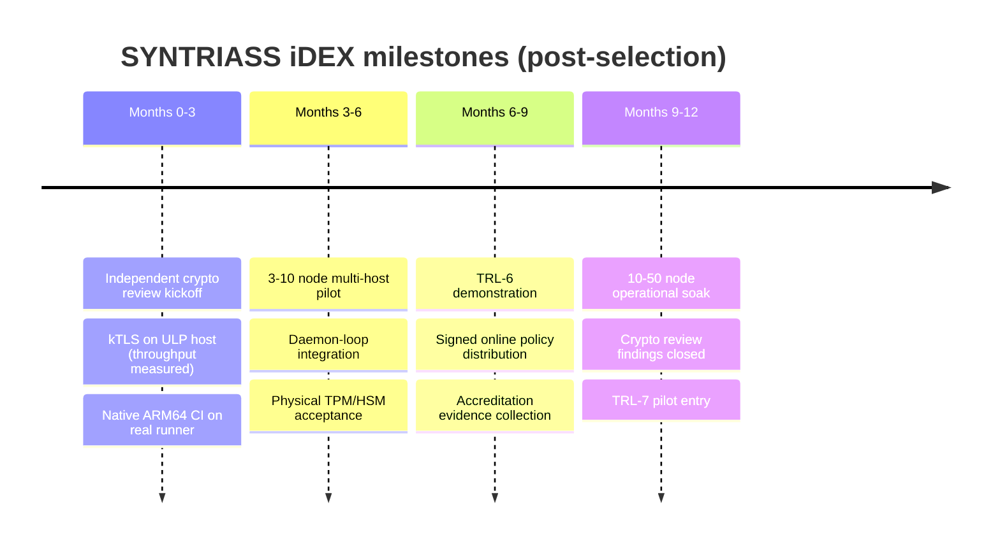

# SYNTRIASS Overlay — iDEX Open Challenge Submission (Master)

*The single entry point to the submission. Every capability claim is tagged
**[measured] [tested] [implemented] [design]** and traces to the repository;
funding/schedule figures are plans, marked as such. Companion documents:
`IDEX_EXECUTIVE_SUMMARY`, `IDEX_PROPOSED_PROBLEM_STATEMENT`,
`IDEX_PROPOSED_TECHNICAL_SOLUTION`, `IDEX_DEFENCE_RELEVANCE`, `IDEX_TRL_PACKAGE`,
`IDEX_VALIDATION_PACKAGE`, `IDEX_COMMERCIALIZATION_PLAN`, `IDEX_EVALUATOR_QA`.*

## Submission Narrative

India's defence communications run on classical cryptography that a future
quantum computer will break — and adversaries are **recording that traffic
today** to decrypt later (harvest-now-decrypt-later). At the same time, secure
links must survive jamming and host compromise. No sovereign solution combines
**post-quantum confidentiality**, **kernel-enforced fail-closed behaviour**, and
**drop-in migration** of the existing application estate. **SYNTRIASS Overlay**
does exactly that, and arrives at the challenge as a **TRL-5, evidence-disciplined
platform** — every claim reproducible, every gap named.

## Problem

Classical key exchange is quantum-vulnerable and HNDL-exposed now; PQC signatures
bloat tactical handshakes; userspace security agents are bypassable by compromised
hosts; and rewriting the deployed estate for PQC is infeasible on the required
timeline. The need: migrate the existing estate to quantum-safe, fail-closed,
kernel-enforced transport — from strategic command to the tactical edge to the
air-gapped enclave. (`docs/IDEX_PROPOSED_PROBLEM_STATEMENT.md`.)

## Solution

A post-quantum, fail-closed **overlay** that upgrades unmodified Linux
applications, enforced in the kernel:

- **Hybrid PQC** (X25519+ML-KEM / Ed25519+ML-DSA, AES-256-GCM) [implemented]+[tested]
- **Out-of-band identity** — runtime handshake −81 % size / −82 % latency, 0
  ML-DSA on the wire [measured]
- **eBPF policy engine** — kernel egress decision in 343 ns; quarantine in 325 ns
  [measured]
- **Zero-plaintext, structurally** — no plaintext posture is representable [tested]
- **Autonomous recovery** — FullPqc/EncryptedFallback/FailClosed, failover 2.0 ms
  [measured]
- **Deploy / air-gap / fleet** — install→validate on a fresh host; offline
  provisioning; 120-node fleet [tested]

(`docs/IDEX_PROPOSED_TECHNICAL_SOLUTION.md` — with Mermaid architecture, security,
fail-closed, deployment, and migration diagrams.)

## Validation

| Dimension | Result | Tag |
|---|---|---|
| PQC + record layer | hardened; fuzz bug fixed; no false accepts | [tested] |
| OOB identity | −81.1 % size, −82.2 % latency, 0 ML-DSA on wire | [measured] |
| Anti-DoS | 5 000-source flood → 25 PQC ops | [measured] |
| Fail-closed assurance | Miri+Loom+fuzz; 2 bugs fixed; no plaintext state | [tested] |
| Universal interception | 7/7 runtimes; EPERM deny | [measured] |
| eBPF policy engine | 343 ns lookup, 325 ns quarantine, ~22k eps audit | [measured] |
| Battlefield resilience | 10–45 % loss, 0 plaintext leaks, reconnect ~3.5 ms | [measured] |
| Multi-node | 50 nodes / 1 225 sessions; fleet-wide fail-closed | [measured] |
| Deployment scenario | 5-node, 4 events, zero cleartext | [measured] |
| ARM64 | 193 tests pass on the ARM64 ISA | [measured-emulated] |
| Key storage | TPM2/PKCS#11 via real adapter | [tested] |
| Deploy/air-gap/fleet | fresh-host install; offline; 120 nodes | [tested] |

Full method/results/references: `docs/IDEX_VALIDATION_PACKAGE.md`. Master ledger:
`docs/DEFENCE_READINESS_REVIEW.md` (25 findings, all re-assessed with evidence).

## TRL

**Current: TRL 5** (validated in a relevant, simulated-contested environment with
real kernel enforcement). **Path to TRL 6:** kTLS activation on a TLS-ULP host,
native ARM64 hardware, real multi-host pilot, physical TPM/HSM, independent crypto
review, daemon-loop integration. **Path to TRL 7:** defence pilot + accreditation +
operational soak. No inflated claims. (`docs/IDEX_TRL_PACKAGE.md`.)

## Funding Ask (plan)

A **SPARK grant** to convert the six named `[design]` items into measured results
and run a defence pilot:

| Allocation | Outcome |
|---|---|
| ~30 % Independent cryptographic review | protocol + implementation assured |
| ~25 % Hardware validation (ARM64 silicon, TPM/HSM, kTLS host) | every `[design]` perf tag → `[measured]` |
| ~25 % Multi-host pilot (10→50 nodes) | TRL-6 demonstration |
| ~20 % Production hardening + accreditation docs | evaluation-entry release |

(`docs/IDEX_COMMERCIALIZATION_PLAN.md`.)

## Milestones (indicative plan)

- **M3:** kTLS throughput measured; crypto review underway; native ARM64 numbers.
  → MIG-2/ARM-1 leave `[design]`.
- **M6:** real multi-host pilot live; daemon integrated; TPM/HSM on hardware.
  → MN-1/DEP-1 strengthened; TRL 6 in sight.
- **M9:** TRL-6 demonstration; signed fleet distribution. → MIG-6 transport closed.
- **M12:** operational soak at scale; crypto findings closed. → TRL-7 entry.

## Defence Impact

Quantum-safe confidentiality for the existing estate **without rewrites**;
kernel-guaranteed no-plaintext-leak even under host compromise; mission
availability under jamming via always-encrypted degradation; sovereign
cryptographic control deployable from strategic command to the tactical edge to
the air-gapped enclave — across Army, Navy, Air Force, Strategic Forces, and the
defence backbone. (`docs/IDEX_DEFENCE_RELEVANCE.md`.)

## Open Risks (named, not hidden)

1. **kTLS throughput** unproven here (no TLS ULP) — implemented + fail-safe;
   target ≥28 % line / ~2×. [design]
2. **Native ARM64 silicon** performance (emulated only). [design]
3. **Multi-host** network behaviour + signed online policy distribution. [design]
4. **Physical TPM/HSM** acceptance (software substitutes validated). [design]
5. **No external cryptographic review** yet. (open)
6. **Daemon-loop integration** of Supervisor/CryptoPolicy/quarantine. [design]

Each maps directly to a funded milestone above.

## Recommended Talking Points for Jury Presentation

1. **"Harvest-now-decrypt-later is happening today."** The recording is now; the
   decryption is deferred. Migration must precede the quantum computer — and only
   an *overlay* can migrate the existing estate in time.
2. **"Plaintext is impossible, not just discouraged."** No plaintext state is
   representable in the code — compiler-enforced, fuzz-verified, wire-confirmed.
   This is a structural guarantee competitors can't make. [tested]
3. **"The kernel enforces it, so a captured host can't leak."** 343 ns egress
   decision in the kernel; userspace shims (and 4 of 7 runtimes) can't match it. [measured]
4. **"81 % smaller handshakes for the tactical edge."** Out-of-band identity makes
   PQC affordable on jammed, low-bandwidth bearers. [measured]
5. **"Sovereign, NIST-standard, memory-safe, air-gap native."** Indian-controlled
   Rust on Linux; no foreign crypto black box; offline-deployable.
6. **"We don't overclaim."** TRL 5 with reproducible evidence and six honestly-
   named gaps — each one a funded milestone, not a research unknown. That
   discipline is itself the strongest signal of a fundable, fieldable team.
7. **The ask:** a SPARK grant + a pilot to turn six `[design]` items into
   `[measured]` results and put a sovereign PQC migration platform into a real
   defence network.

---

### Output for this submission package

1. **Documents Created** — `IDEX_EXECUTIVE_SUMMARY.md`,
   `IDEX_PROPOSED_PROBLEM_STATEMENT.md`, `IDEX_PROPOSED_TECHNICAL_SOLUTION.md`,
   `IDEX_DEFENCE_RELEVANCE.md`, `IDEX_TRL_PACKAGE.md`, `IDEX_VALIDATION_PACKAGE.md`,
   `IDEX_COMMERCIALIZATION_PLAN.md`, `IDEX_EVALUATOR_QA.md` (100 Q&A), and this
   master.
2. **Missing Evidence** — kTLS throughput (no TLS ULP here); native ARM64 silicon
   numbers; physical TPM/HSM acceptance; real multi-host convergence; independent
   crypto review; daemon-loop integration. All `[design]`/open, each a funded
   milestone.
3. **Open Risks** — the six items above; none is a security risk to the
   fail-closed/zero-plaintext guarantees (kTLS is throughput-only; the platform is
   secure without it).
4. **Recommended Submission Narrative** — *"A sovereign, evidence-disciplined PQC
   migration overlay that makes the existing defence estate quantum-safe and
   fail-closed in the kernel — already validated to TRL 5 with reproducible
   numbers, asking for a SPARK grant + pilot to close six honestly-named gaps and
   reach a TRL-6 field demonstration."*
